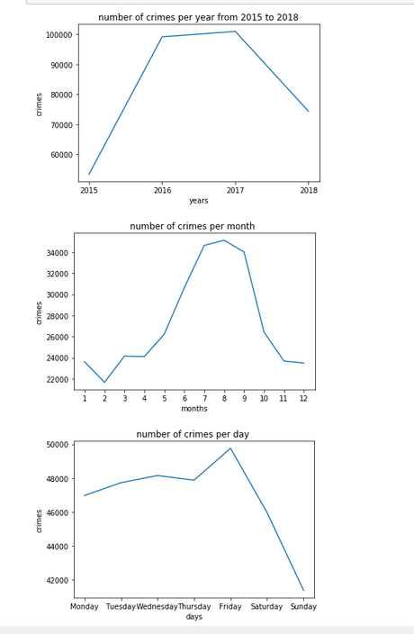
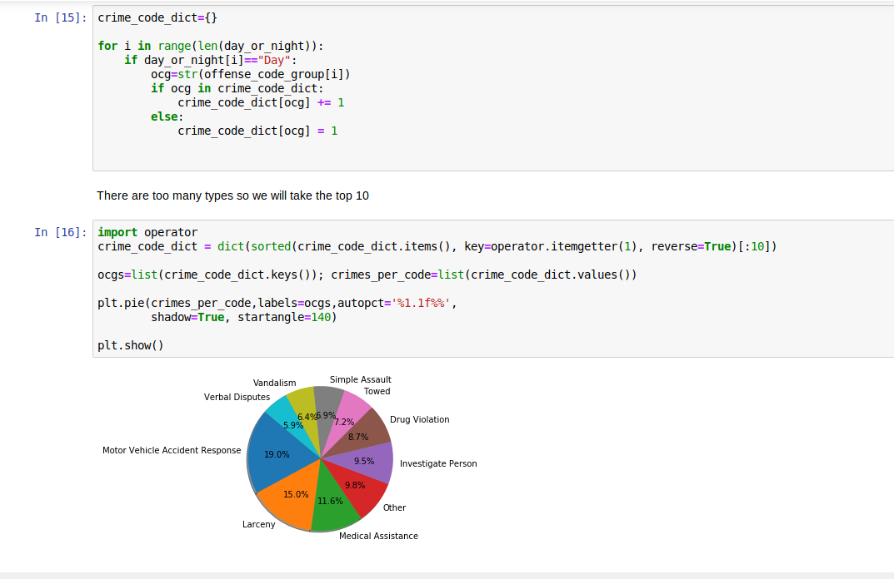
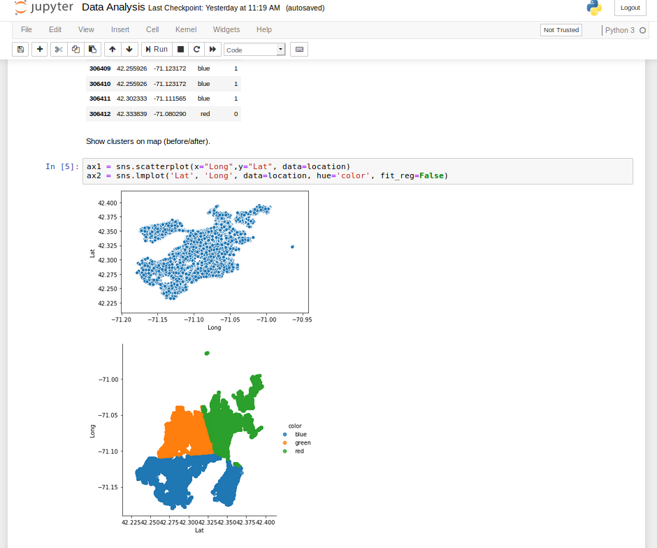
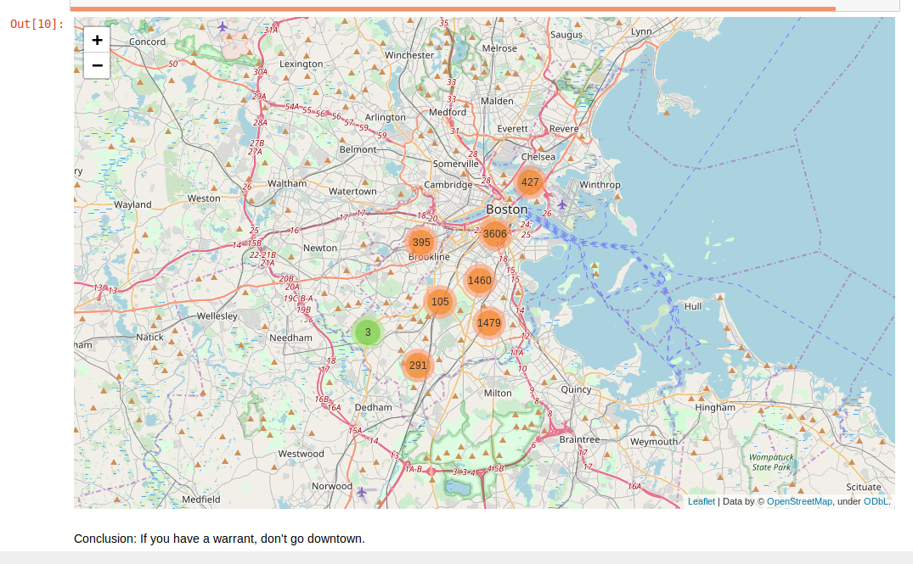
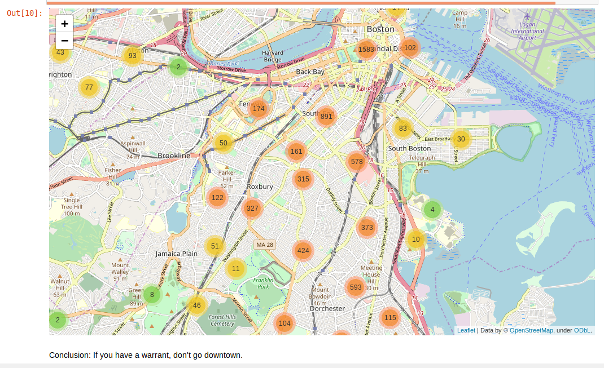

# Data-Analysis-Crimes-in-Boston

Data analysis of Crime Incident Reports (https://data.boston.gov/group/public-safety).

Crime incident reports are provided by Boston Police Department (BPD) to document the initial details surrounding an incident to which BPD officers respond.

# Questions
Using Data extraction methodologies and python libraries we showcase and answer the following questions and more:

-When and where were the most crimes commited? (per year, month, day, district)

-When and where the most shootings happened?

-Do more crimes happend during the day or the night?

-What is the most common crime during the day?

etc.

# Clustering
Plus, we did clustering based on the GPS data in order to find the Crime Clusters around Boston.
Clustered either by only the location, or a combination of (location, MONTH) and (location, OFFENSE_CODE).

# Interactive Map
In the jyputer notebook, we also provide an interactive map where you can select a certain OFFENSE_CODE_GROUP (i.e Homicide) and get dymanic clustering shown on the map as you zoom in and out

Dependencies:
[pandas, sklearn, seaborn, matplotlib, numpy, folium]

# Examples
Below are some screenshots from the notebook, in case you want to satisfy your curiosity but are too lazy to open the notebook.

The last one agrees the hypothesis that crime is a profession. And that the professionals need rest during the weekend.

Clustering with 3 clusters based only on location. You see that there are no distinct clusters and that crime is pretty normalized throughout the city.

Map when clustering by location for Warrant Arrests.

And the same map zoomed in.

